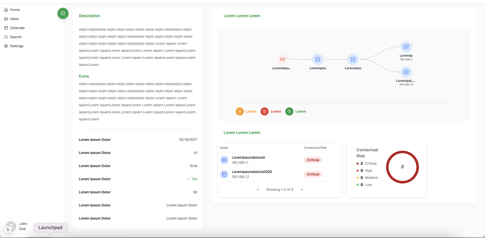

# Graph Visualizer

A modern and modular web application for visualizing contextual risk through interactive diagrams and structured data panels.

## 🧠 Overview

The **Graph Visualizer** enables users to explore a system or network of interconnected assets, and understand contextual risks through:

- Interactive diagrams
- Risk panels and severity summaries
- Rich metadata and descriptions
- Visual indicators for threat levels

Designed with responsiveness, modularity, and clarity in mind.

---

## 🛠️ Technologies

- **Next.js** + **TypeScript** – Core framework
- **React** – Component architecture
- **Tailwind CSS** – Styling and layout
- **Lucide Icons** – Modern icon library
- **@xyflow/react** – For diagram rendering
- **Context API** – Sidebar state management

---

## 🧱 Layout Structure

```
RootLayout
├── SidebarProvider
│   ├── AppSidebar (navigation)
│   └── Page
│       ├── DescriptionPanel (left column)
│       └── MainRiskPanel (right column)
```

- **Left Column**: Textual descriptions, extra metadata, asset details
- **Right Column**: Graph diagram, risk categorization, and a contextual summary

---

## 🧩 Main Components

### `FlowContent` (from `components/diagram/FlowContent.tsx`)
Responsible for rendering the graph using [`@xyflow/react`](https://reactflow.dev/).

- Pulls node and edge data from `useDiagramData` hook
- Uses custom node types from `nodeTypes`
- Diagram is **non-interactive** (static view only):
  - Nodes are not draggable
  - No zooming or panning
  - No selectable elements

This component is intended for **display-only visualizations** of system flow or asset connections.

### `DescriptionPanel`
Displays textual information about the selected item, including:

- A description block
- Extra metadata
- A small label-value table (with icons for status)

### `MainRiskPanel`
The core interactive panel, includes:

- `DiagramPanelExtra`: renders an interactive flow chart of assets
- Legend showing risk types (with icons & colors)
- `RiskPanel`: table listing assets and their contextual risk
- `RiskSummary`: summary of risk levels (with pie-style visual)

---

## 📊 Risk Data Format

```ts
type RiskData = {
  name: "Critical" | "High" | "Medium" | "Low";
  value: number;
  color: string; // HEX color used in charts & labels
}
```

---

## 📁 File Structure Highlights

```
src/
├── components/
│   ├── descriptionPanel/
│   │   └── DescriptionPanel.tsx
│   ├── diagram/
│   │   └── DiagramPanelExtra.tsx
│   ├── riskPanel/
│   │   ├── MainRiskPanel.tsx
│   │   ├── RiskPanel.tsx
│   │   └── RiskSummery.tsx
│   └── ui/
│       └── shared UI elements (card, header, icon, etc.)
├── types/
│   └── Global types (e.g., RiskData, User)
```

---

## 📷 Preview



---

## 📌 Getting Started

Clone this repository:

```bash
git clone https://github.com/your-username/graph-visualizer.git
cd graph-visualizer
```

Install dependencies:

```bash
pnpm install
```

Run the development server:

```bash
pnpm dev
```

Open [http://localhost:3000](http://localhost:3000) in your browser to see the app in action.

---

## 📌 TODO

- [ ] Integrate live data from API
- [ ] Add user roles & permissions
- [ ] Dark mode support

---

## 📄 License

MIT – Feel free to use, modify, and contribute.
